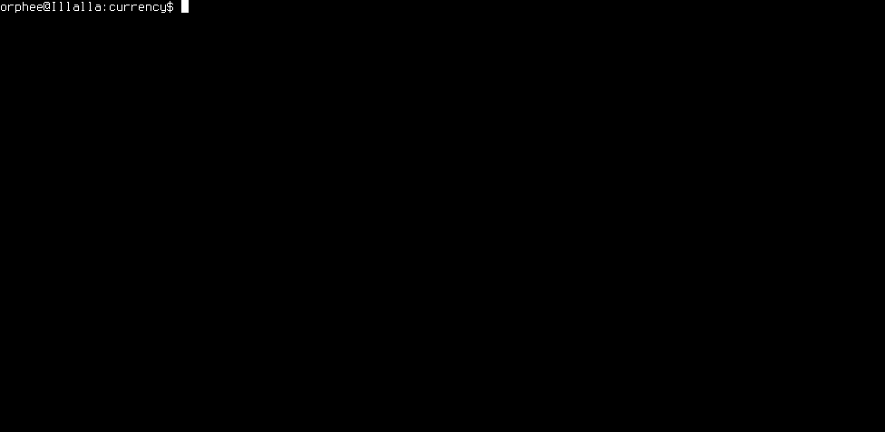

# Euro converter

Convert an amount of euros to another currency or vice versa

Small program to start learning Rust.

## Usage
```
currency [FLAGS] [ARGS]

FLAGS:
    -h, --help       Prints help information
    -l, --list       show available currencies
    -r, --reverse    convert from the chosen currency to euro

ARGS:
    currency    short code for currency
    amount      Amount of money to be converted
```

## Demo




## Installation

[Download binary](https://github.com/daureg/currency/releases/download/v0.5/currency.linux.x86-64) from github (only for Linux)

Otherwise:

1. [Install Rust](http://doc.rust-lang.org/nightly/book/installing-rust.html)
2. `git clone https://github.com/daureg/currency`
3. `cargo build --release`
